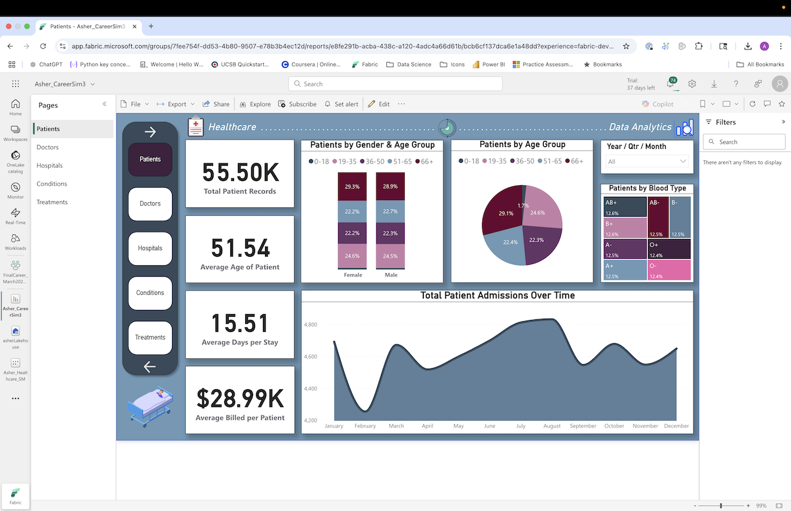
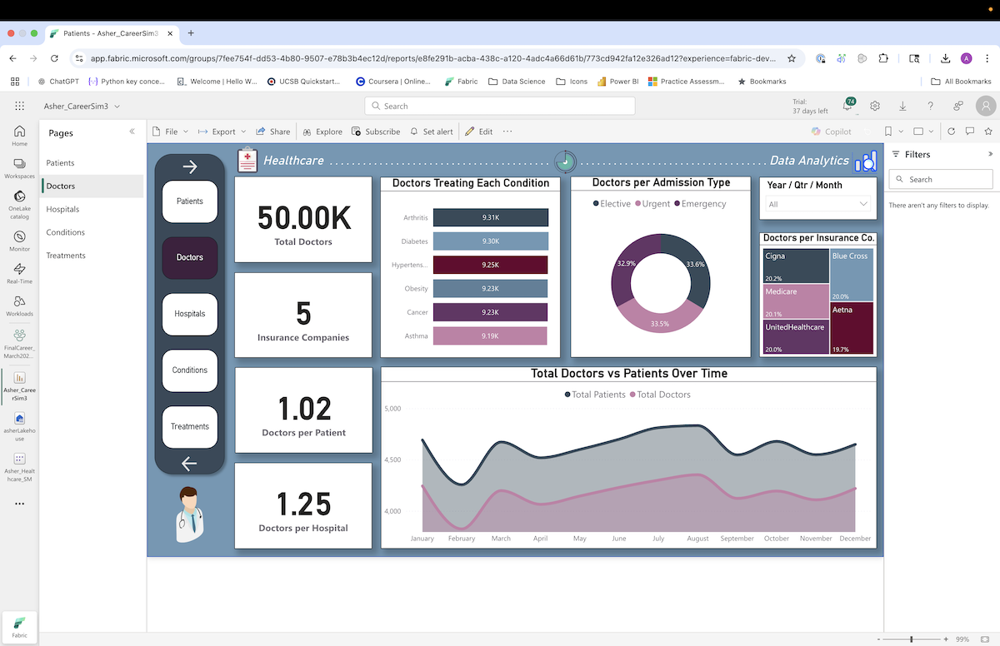
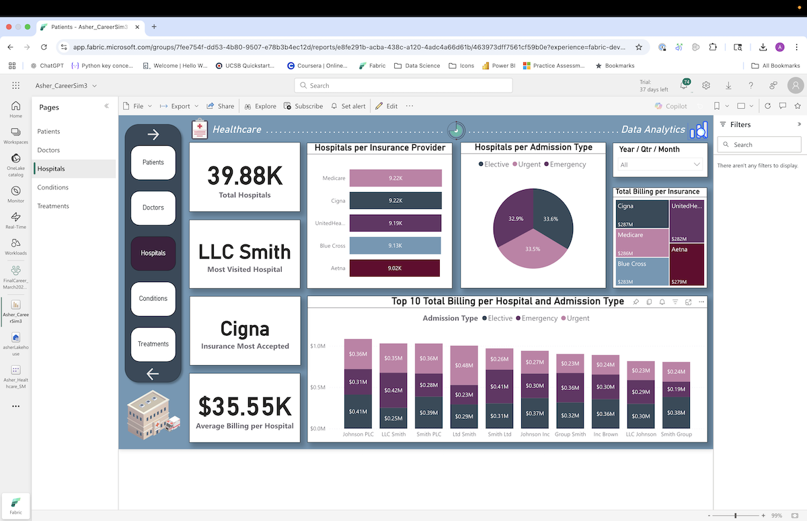
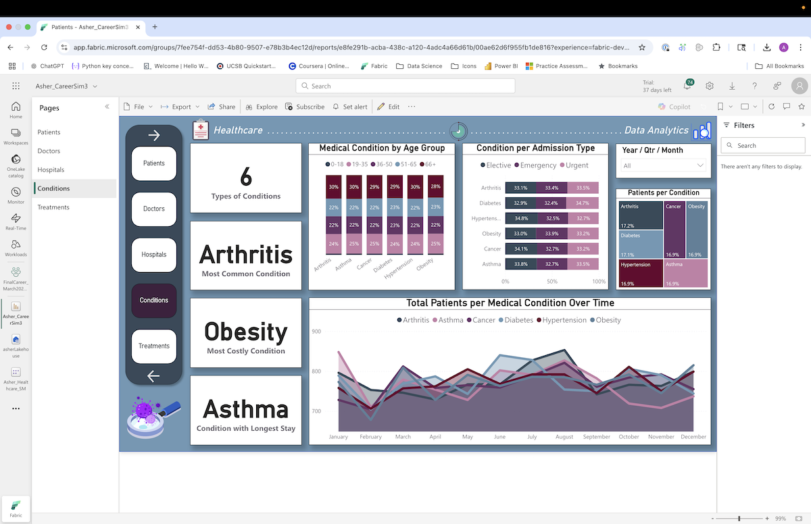
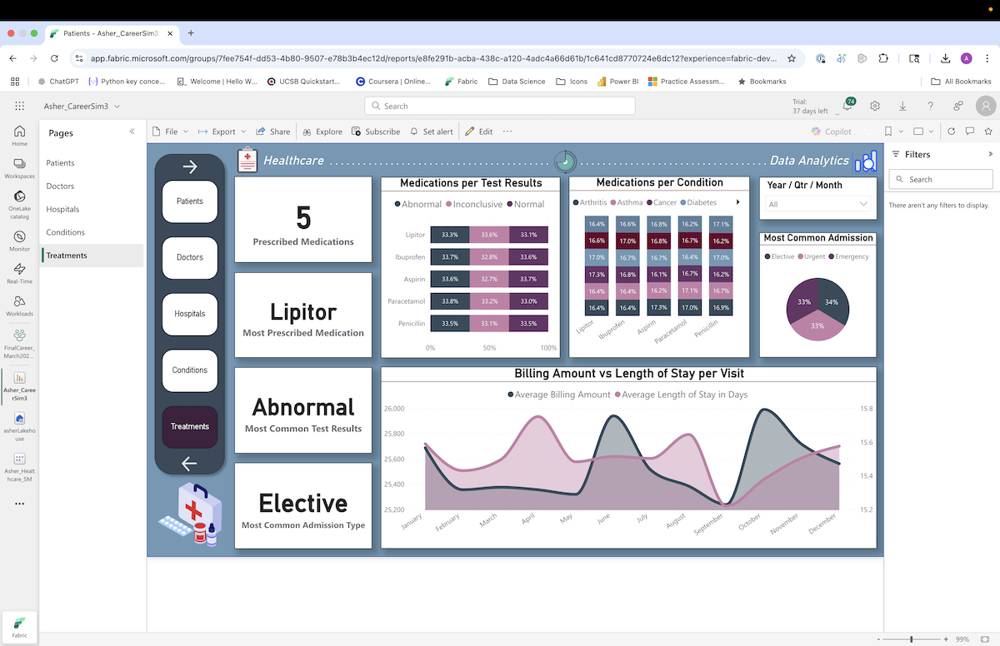
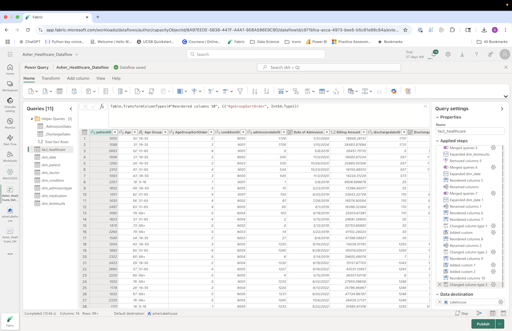
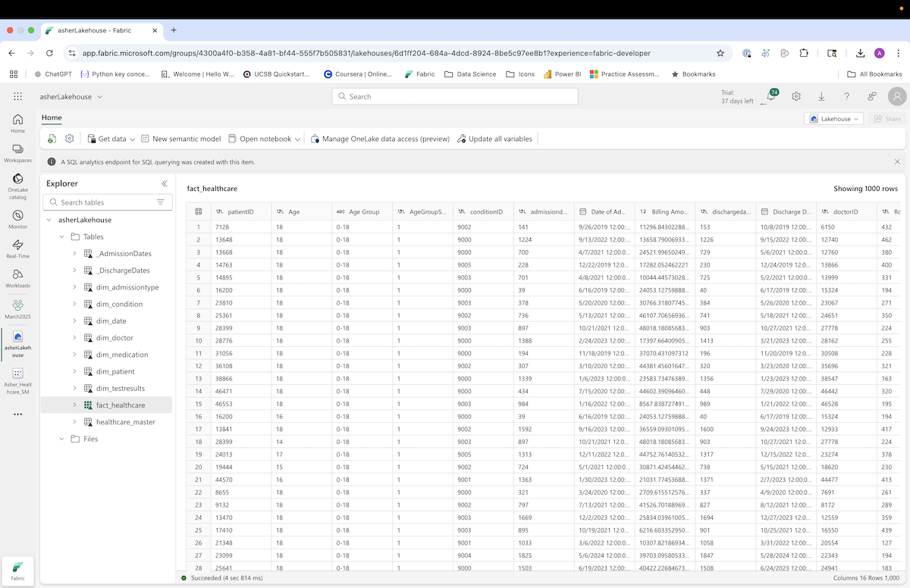
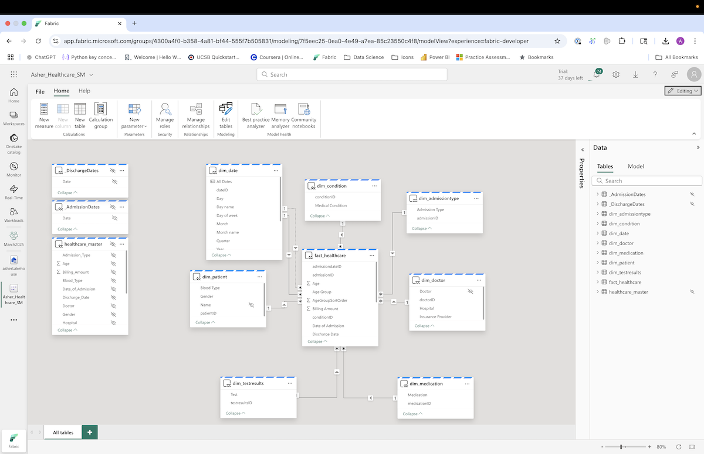

# healthcare-data-analysis
Capstone healthcare analytics project showcasing SQL, MS Fabric, and Power BI. Built a scalable star schema, applied advanced data transformations, and implemented row-level security. Developed an interactive dashboard that reveals patient demographics, conditions, treatments, and hospital performance, highlighting business and clinical insights.

# 🩺 Healthcare Data Analysis – Capstone Project

## 🔹 Executive Summary
End-to-end healthcare analytics project using **Microsoft Fabric (Lakehouse + Dataflow Gen2 + Semantic Model)**, **SQL/Power Query (M)**, **DAX**, and **Power BI**.  
I designed a star schema, implemented data-quality and privacy controls, and built a **5-page interactive dashboard** to explore patient, doctor, hospital, condition, and treatment patterns.  
*(This project was completed individually.)*

---

## 🔹 Dataset
- **Source:** [Healthcare Dataset with Multi-Category Classification (Kaggle)](https://www.kaggle.com/datasets/prasad22/healthcare-dataset)  
- **Scope:** ~55,500 patient records with attributes such as Age, Gender, Blood Type, Condition, Admission/Discharge Dates, Doctor, Hospital, Insurance, Billing Amount, Medications, and Test Results.  
- **Privacy:** Public/anonymized data; no PHI. Additional masking applied in the model (see Security).  

---

## 🔹 Tools & Skills
- **Microsoft Fabric:** Lakehouse, Dataflow Gen2 (Power Query), Semantic Model  
- **Modeling:** Star schema (fact + dimensions), one-to-many relationships, single-direction cross-filtering  
- **Languages:** SQL / Power Query **M**; **DAX** for measures  
- **Visualization:** **Power BI** (interactive visuals, slicers, drillthrough, synced filters, custom nav)  
- **Governance:** Row-Level Security (RLS) + masking workaround for sensitive attributes  

---

## 🔹 Methodology (ELT → Model → Visualize)

1. **Extract**
   - Loaded CSV (~55.5k rows) to **Fabric Lakehouse**.
   - Fixed upload validation by renaming whitespace columns (e.g., `Blood Type` → `Blood_Type`).

2. **Transform & Model**
   - Cleaned and typed columns, standardized dates, checked nulls/outliers.
   - Built **dimension tables**: patient, doctor, condition, admission type, medication, test result, date.
   - Created **fact_healthcare** for transactional fields (billing, dates, admissions).
   - **Date handling:** combined admission/discharge dates into `dim_date`, kept originals in fact for LOS calculations.
   - Fixed duplication issue (multi-admission patients) by moving Age back to fact table while preserving unique patient IDs.
   - Added calculated columns: month, quarter, **Length of Stay (LOS)**, and age groups with numeric sort keys.

3. **Load & Secure**
   - Published Dataflow → Fabric Workspace → Semantic Model.
   - Configured **RLS** for sensitive identifiers; implemented masking workaround for unsupported OLS.

4. **Visualize (Power BI)**
   - **5 dashboard pages:** Patients, Doctors, Hospitals, Conditions, Treatments.
   - Consistent layout: KPI cards, time-trend chart, supporting visuals, synced slicers, custom nav.
   - Visuals: area, stacked bar/column, pie/donut, treemap.
   - Custom **DAX** for rankings, conditional totals, and filtered aggregations.

---

## 🔹 Key Insights
- 👤 **Average patient age ~51.5**; ages 0–18 were the smallest cohort.  
- 🩸 **AB+** was the most common blood type; others evenly distributed.  
- ⚧ Gender distribution was **~50/50** male vs female.  
- ⏱️ **Average hospital stay = 15.5 days**.  
- 📅 **February admissions** were consistently the lowest.  
- 🩺 **~50,000 doctor IDs**; more doctors than individual patients; near 1:1 doctor:hospital ratio.  
- 🏥 **~40,000 hospitals** represented; avg billing ≈ $35,550; highest single-hospital billing > $363k.  
- 🔀 Hospital with most admissions ≠ hospital with highest billing.  
- 🦴 **Arthritis** most frequent condition; **Obesity** had highest total billing; **Asthma** longest avg LOS.  
- 💊 **Lipitor** most prescribed med; “**Abnormal**” was the most common test result.  
- 🏷️ **Elective admissions** were most frequent.  
- 📉 Billing did not correlate consistently with LOS, showing misalignment between cost and duration.  

---

## 🔹 Interpretation & Caveats
- Data showed **uniform distributions** and unusual 1:1 ratios → consistent with **synthetic** data.  
- Insights should be read as **skills demonstration**, not clinical claims.  
- Pipeline, schema, governance, and dashboard design patterns are directly transferable to **real healthcare data with PHI**.  

---

## 🔹 Deliverables
- 📄 **Reports:** [/reports/](reports/) (written report, dashboard export PDF)  
- 🗄️ **SQL / M:** [/sql/](sql/) (schema & transformation scripts)  
- 📊 **Power BI:** [/powerbi/](powerbi/) (PBIX – Fabric-based connection)  
- 🖼️ **Assets:** [/assets/](assets/) (dashboard screenshots)  

---

## 🔹 Screenshots  

### Patients View

### Doctors View

### Doctors View

### Conditions View

### Treatments View

### Fabric Dataflow

### Fabric Lakehouse

### Fabric Semantic Model

---

## 🔹 Limitations & Viewing Instructions
- The dashboard was developed using **Microsoft Fabric Dataflows** with a live connection to a Semantic Model.  
- Because that Fabric workspace was part of a school account, it is no longer accessible.  
- As a result, the provided `.pbix` cannot be refreshed or fully opened outside of that environment.
- The `.pbix` is included only as evidence of work completed, not as a standalone reproducible artifact.  
- For a complete view of the project, please refer to:  
  - The **written report** in `/reports/`  
  - The **dashboard export (PDF)** in `/reports/`  
  - The **screenshots** in `/assets/`

---

## 🔹 Project Summary
This project demonstrates a complete **end-to-end healthcare analytics pipeline**:  
- Data ingestion, cleaning, and normalization  
- Star schema and semantic model design  
- Governance with RLS and masking  
- Interactive Power BI dashboard  

While the dataset was synthetic, the workflow highlights **technical depth, data modeling rigor, and dashboard design skills** that directly apply to real healthcare and business analytics contexts.  
